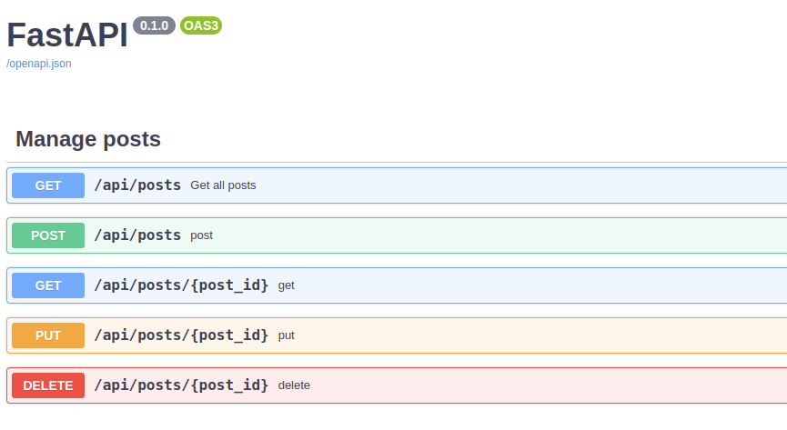

In this extension, the API is built using the `Resource` classes.<br>
They are built based on the capabilities of `FastAPI`, namely `APIRouter` and `Route`

The `Resource` classes provide easy access to HTTP methods.<br> 

---

## Example of CRUD operations:
Consider an example with posts.<br> 

!!! note
    `posts = []` is used as a simulation of the database `posts` table.

```python title="posts.py" linenums="1"
from uuid import UUID, uuid4

from fastapi import FastAPI, Response, HTTPException, Query
from fastapi_restful import RESTExtension, Resource
from pydantic import BaseModel, Field
from uvicorn import run

app = FastAPI()
api = RESTExtension(app)
posts = []


class NewPost(BaseModel):
    id: UUID = Field(default_factory=uuid4)
    body: str


class UpdatePost(BaseModel):
    body: str


class Posts(Resource):

    def get(self, query_param: str = Query(None, description='My query')):
        return {'items': posts, 'total_count': len(posts)}

    def post(self, new_post: NewPost):
        posts.append(new_post)
        return {'post_id': new_post.id}


class SpecificPost(Resource):

    def get(self, post_id: UUID):
        post = next(filter(lambda x: x.id == post_id, posts), None)
        if post is None:
            raise HTTPException(status_code=404)
        return post

    def put(self, post_id: UUID, new_data: UpdatePost):
        post = next(filter(lambda x: x.id == post_id, posts), None)
        if post is None:
            raise HTTPException(status_code=404)
        post.body = new_data.body
        return post

    def delete(self, post_id: UUID):
        post = next(filter(lambda x: x.id == post_id, posts), None)
        if post is None:
            return Response(status_code=204)
        posts.remove(post)
        return Response(status_code=204)


urls = {
    '/posts': Posts,
    '/posts/{post_id}': SpecificPost
}

for path, resource in urls.items():
    api.add_resource(resource, path=path)
api.apply()

if __name__ == '__main__':
    run('posts:app')

```

### Serialization of input data

```python title="posts.py" linenums="11" hl_lines="3-5 8-9 14 17 24 30 37"
...

class NewPost(BaseModel):
    id: UUID = Field(default_factory=uuid4)
    body: str


class UpdatePost(BaseModel):
    body: str


class Posts(Resource):

    def get(self, query_param: str = Query(None, description='My query')):
        return {'items': posts, 'total_count': len(posts)}

    def post(self, new_post: NewPost):
        posts.append(new_post)
        return {'post_id': new_post.id}


class SpecificPost(Resource):

    def get(self, post_id: UUID):
        post = next(filter(lambda x: x.id == post_id, posts), None)
        if post is None:
            raise HTTPException(status_code=404)
        return post

    def put(self, post_id: UUID, new_data: UpdatePost):
        post = next(filter(lambda x: x.id == post_id, posts), None)
        if post is None:
            raise HTTPException(status_code=404)
        post.body = new_data.body
        return post

    def delete(self, post_id: UUID):
        post = next(filter(lambda x: x.id == post_id, posts), None)
        if post is None:
            return Response(status_code=204)
        posts.remove(post)
        return Response(status_code=204)
...
```
You can declare `pydantic` models for serialize body, query and path parameters, 
just like you would do with a standard route declaration in `FastAPI`

### Declaring urls
```python title="posts.py" linenums="53" hl_lines="3-6"
...

urls = {
    '/posts': Posts,
    '/posts/{post_id}': SpecificPost
}

for path, resource in urls.items():
    api.add_resource(resource, path=path)
api.apply()
...
```
Declare the path in the `urls` dictionary, where the key is the path to the resource, and the value is the corresponding class.<br>

!!! note 
    It is allowed not to specify the route paths in the `urls` dictionary, but instead to specify them in the classes themselves, in the `path` attribute.

    In this case, only your class should be passed to the `add_resource` method.


And then the familiar commands are already coming: 
 
- `add_resource` - Add a resource to the api
- `apply` - include all declared routes from `api` to your `FastAPI` app

As a result, you will have 5 routes announced:

- `GET /api/posts`
- `POST /api/posts`
- `GET /api/posts/{post_id}`
- `PUT /api/posts/{post_id}`
- `DELETE /api/posts/{post_id}`

---

## Route settings
You probably know that `FastAPI` allows you to pass various arguments when declaring a route, such as: `summary`, `response_model` etc.<br>
Here it can also be done using the `route_settings` decorator.

```python title="posts.py" linenums="1" hl_lines="4"
from uuid import UUID, uuid4

from fastapi import FastAPI, Response, HTTPException, Query
from fastapi_restful import RESTExtension, Resource, route_settings
from pydantic import BaseModel, Field
from uvicorn import run

...
```

Import `route_settings`


```python title="posts.py" linenums="20" hl_lines="5"
...

class Posts(Resource):

    @route_settings(summary='Get all posts')
    def get(self, query_param: str = Query(None, description='My query')):
        return {'items': posts, 'total_count': len(posts)}

...
```
With this decorator, we can throw all the arguments that accepts method the `FastAPI.add_api_route`.
!!! note 
    The example below is absolutely identical.<br> In this example, the route is declared with standard `FastAPI` methods.
    
    ```python
    app.get('/api/posts', summary='Get all posts')
    def all_posts(self, query_param: str = Query(None, description='My query param')):
        return {'items': posts, 'total_count': len(posts)}
    ```

---

## Resource tag
The `Resource` class has the `tag` attribute. 
We can set it a value, for example, for grouping routes in the `swagger` documentation.

```python title="posts.py" linenums="20" hl_lines="5 18"
...

class Posts(Resource):

    tag = 'Manage posts'

    @route_settings(summary='Get all posts')
    def get(self, query_param: str = Query(None, description='My query')):
        return {'items': posts, 'total_count': len(posts)}

    def post(self, new_post: NewPost):
        posts.append(new_post)
        return {'post_id': new_post.id}


class SpecificPost(Resource):
    
    tag = 'Manage posts'

    def get(self, post_id: UUID):
        post = next(filter(lambda x: x.id == post_id, posts), None)
        if post is None:
            raise HTTPException(status_code=404)
        return post

    def put(self, post_id: UUID, new_data: UpdatePost):
        post = next(filter(lambda x: x.id == post_id, posts), None)
        if post is None:
            raise HTTPException(status_code=404)
        post.body = new_data.body
        return post

    def delete(self, post_id: UUID):
        post = next(filter(lambda x: x.id == post_id, posts), None)
        if post is None:
            return Response(status_code=204)
        posts.remove(post)
        return Response(status_code=204)
...
```
Set the value `Manage posts` for each attribute `tag` of the `Resource` classes.

If you launch the application and open the documentation page in the browser (`http://127.0.0.1:8000/docs`), 
you will see that all routes are grouped by tag the `Manage posts`
{ align=left }
